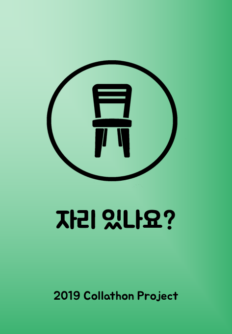
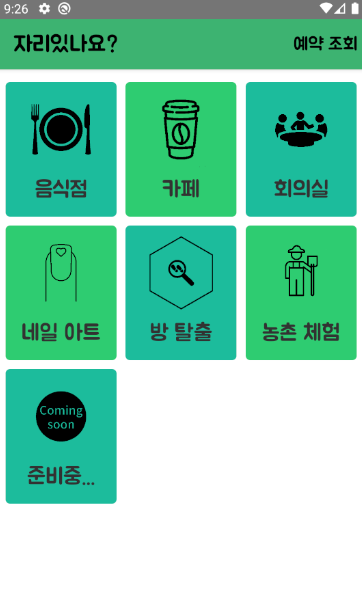
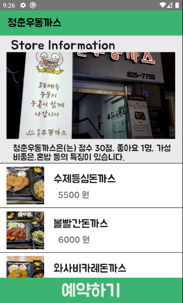
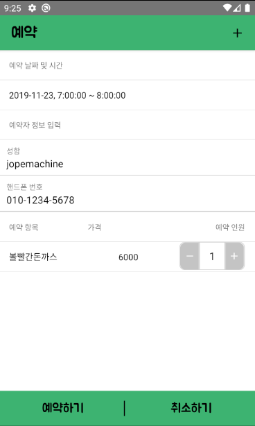
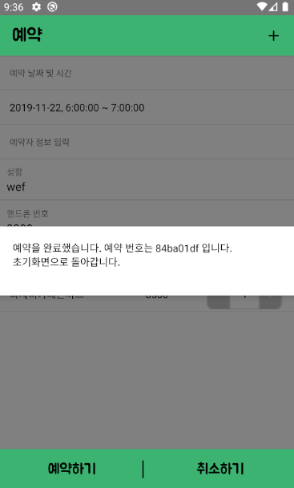
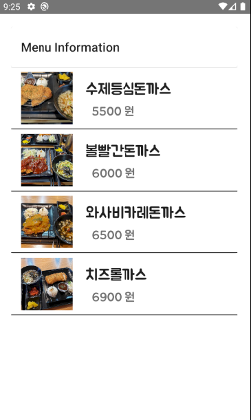
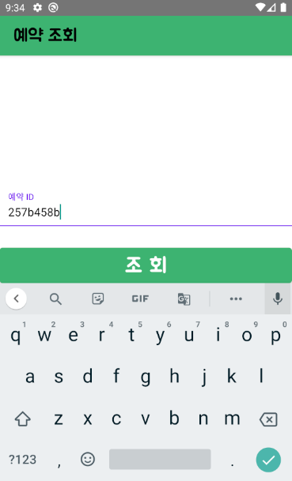
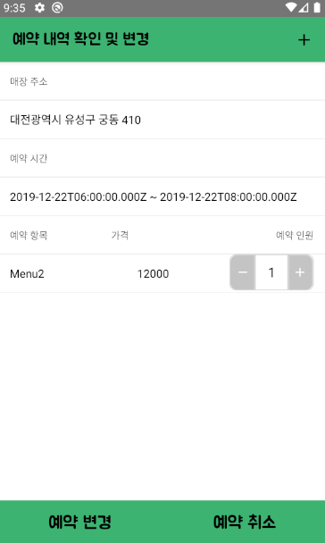
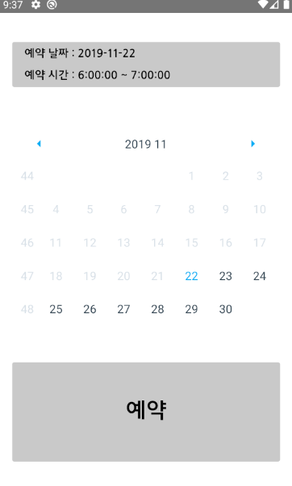

<h1 align="center">
    <a href="#">
    자리 있나요?
   </a>
</h1>

Tested on Android 10  

2019 Software Engineering Team Project  

2019 CNU Collathon  

- [**BookingApp-Front**][a] : 리액트 네이티브로 작성된 앱의 프론트 입니다.

- [**BookingApp-Backend**][b] : 노드 JS, Express로 작성된 백엔드 서버입니다. 

- [**BookingApp-Web**][c] : 자영업자에게 사업장, 메뉴 정보 등을 등록하고, 고객들의 예약 현황을 관리할 수 있게 하는 웹 페이지 입니다. 

[a]: https://github.com/CNU-collathon/BookingApp-Front
[b]: https://github.com/CNU-collathon/BookingApp-Backend
[c]: https://github.com/CNU-collathon/BookingApp-Web

## 📋 Dependency

> react 16.9.0
>
> react-native 0.61.2
>
> react-native-gesture-handler 1.4.1
>
> react-native-paper 2.16.0
>
> react-native-vector-icons 6.6.0
>
> react-navigation-stack 1.9.4
>
> react-native-splash-screen
>
> react-native-super-grid 3.1.1
>
> react-native-vector-icons 6.6.0
>
> react-navigation 4.0.10
> 
> react-navigation-stack 1.10.3
> 
> react-native-24h-timepicker
>
> react-native-calendars
>
> react-native-modal
> 
> react-native-axios
>
> react-native-dialog-component

## ⛷️ How to use

npm i로 package.json의 node_modules를 설치.

npm i react-native-cli -g로 react-native-cli를 전역에 설치.

AVD Manager로 시뮬레이터를 구동한 뒤 react-native run-android로 실행

## ✔️ Screen shot

* 스플래시 스크린

* 카테고리 선택 화면

* 가게 화면

* 예약 화면

* 예약 후 화면

* 메뉴 선택 화면

* 예약 조회

* 예약 확인 및 변경

* 날짜 및 시간 선택

